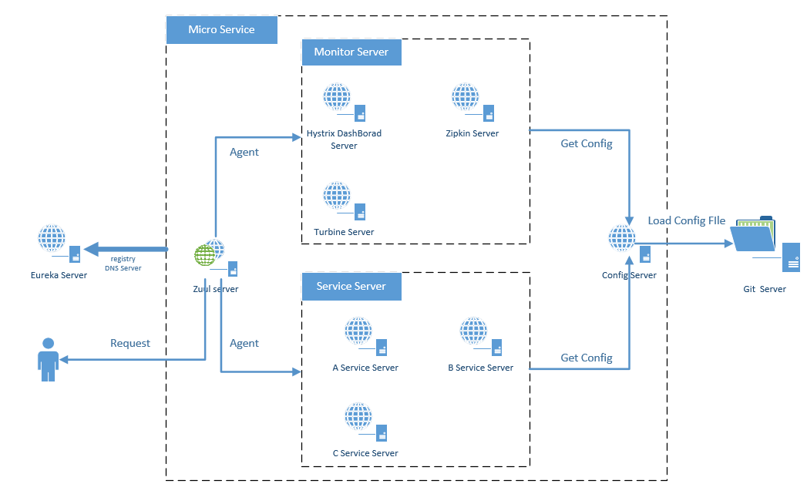

# spring-cloud-2.0

## Overall Framework

官方描述的微服务架构图:

这个Demo展示的架构图:

## Module Decomposition

  Spring Cloud 提供了微服务构建的脚手架, 解决了微服务构建过程中大部分工程问题。
例如，服务发现，服务监控，依赖监控，断路器，自动路由，负载均衡等问题。下面的子项目展其中
工程问题是如何被解决，以及Spring Cloud如何使用这些工具来解决这些工程问题。
 
1. [Spring Cloud Gateway Eureka Example](docs/GatewayEurekaDemo.md)

2. [Spring Cloud Hystrix With Hystrix DashBoard And Turbine](docs/HystrixTurbine.md)

3. [Spring Cloud Sleuth And ZipKin Traces](docs/SleuthZipkinTraces.md)

4. [Spring Cloud Config](docs/CloudConfig.md)
