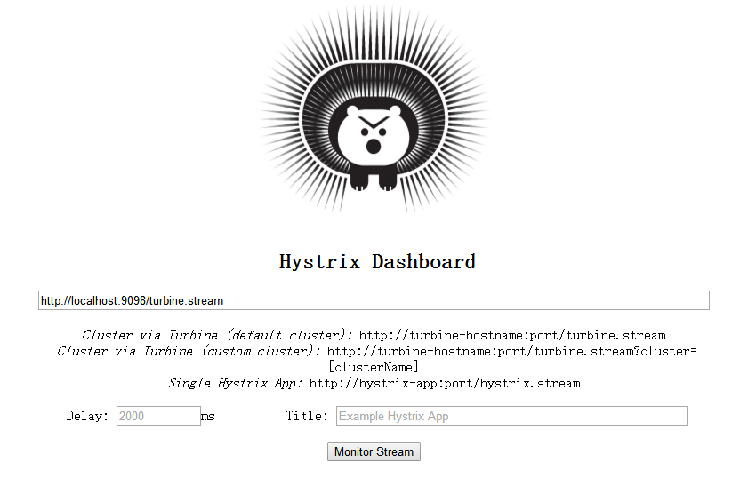
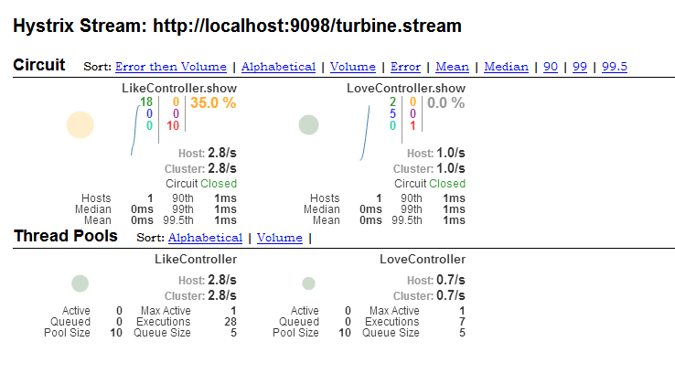

# spring cloud Hystrix with Hystrix DashBoard and Turbine

| Feature| Test url |
|--------|----------|
|Hystrix DashBoard | http://localhost:9098/hystrix |
|hystrix stream | http://localhost:9091/hystrix.stream OR http://localhost:9092/hystrix.stream|
|turbine stream | http://localhost:9098/turbine.stream|
|Hystrix 触发| http://localhost:9092/hello/3?numbers=1,2,3|

## 首先进入Hystrix DashBoard主页

http://localhost:9098/hystrix

此时可以看到页面如下图:



填写 turbine stream(http://localhost:9098/turbine.stream) 点击 monitor Stream 开始监控数据并看到下图展示



另外页可以使用 hystrix stream,不过这部分监控只有找一个节点服务的hystrix监控数据

此时数据一定是空的，需要你访问 http://localhost:9092/hello/3?numbers=1,2,3 来添加更多的数据。

## Hystrix DashBoard 和 Turbine


## The Kernel code

```Java
package com.demo.controller;

import com.demo.service.math.MathService;
import com.netflix.hystrix.contrib.javanica.annotation.HystrixCommand;
import org.springframework.beans.factory.annotation.Autowired;
import org.springframework.beans.factory.annotation.Value;
import org.springframework.http.ResponseEntity;
import org.springframework.web.bind.annotation.*;

import java.util.List;

/**
 * Created by RainBox on 2017/7/8.
 * .
 */
@RestController
@RequestMapping(value = "/hello")
public class HelloController {

    @Value("${hello}")
    String hello;

    private MathService mathService;

    @Autowired
    public HelloController(MathService mathService) {
        this.mathService = mathService;
    }

    @GetMapping
    public ResponseEntity index() {
        return ResponseEntity.ok("Hello Key Config is: " + hello);
    }

    @GetMapping(value = "/{id}")
    @HystrixCommand(fallbackMethod = "objectNotFound", commandKey = "HelloController.show")
    public ResponseEntity show(@PathVariable Integer id,
                               @RequestParam List<Integer> numbers) {
        if (id > 2) {
            throw new RuntimeException("You id big than 2.");
        }

        Integer sum = mathService.sum(numbers);
        return ResponseEntity.ok("Hello Key Config is: " + hello + ", The sum = " + sum);
    }

    public ResponseEntity objectNotFound(Integer id, List<Integer> numbers) {
        if (id > 2) {
            return ResponseEntity.ok(String.format("The id %s is big than 2.", id));
        } else {
            return ResponseEntity.ok("The math server is not found.");
        }
    }
}

```

注意HystrixCommand的触发条件, ID > 2

## Turbine server

  在复杂的分布式系统中，相同服务的节点经常需要部署上百甚至上千个，很多时候，运维人员希望能够把相同服务的节点状态以
一个整体集群的形式展现出来，这样可以更好的把握整个系统的状态。 为此，Netflix提供了一个开源项目（Turbine）
来提供把多个hystrix.stream的内容聚合为一个数据源供Dashboard展示。

turbine-server的配置大致如下

```yaml
server:
  port: 9098

eureka:
  instance:
    metadata-map:
      management.port: http://127.0.0.1:8761/eureka/

spring:
  application:
    name: turbine-server

turbine:
  app-config: hello-server,math-server
  # must add the config
  clusterNameExpression: new String("default")

management:
  security:
    enabled: false
```

其中

```yaml
 clusterNameExpression: new String("default")
```

必须配置,否则Turbine服务的turbine.stream找不到数据
