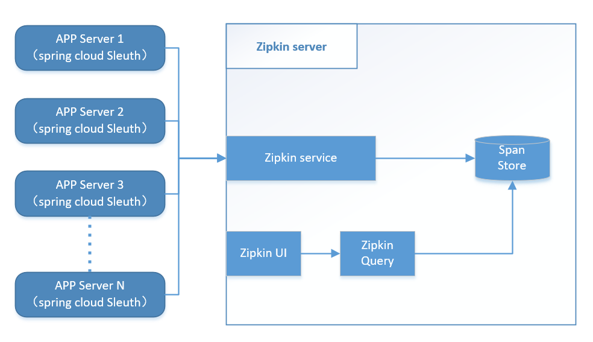

# spring cloud Sleuth Zipkin Traces

Sleuth 负责在Client端搜集资料发给 zipkin server, 之后统一由Zipkin 整理通过 Zipkin UI查看

## Sleuth Zipkin server image



## start Zipkin Server

OpenZipkin [Quickstart](https://zipkin.io/pages/quickstart).

启动一个zipkin服务

    docker run -d -p 9411:9411 openzipkin/zipkin

## Test Url

| Feature| Test url |
|--------|----------|
|Make Some Trace Data | http://localhost:9080/hello-server/hello|
|Make Some Trace Data | http://localhost:9080/hello-server|
|Make Some Trace Data | http://localhost:9080/math-server|

## ZipKin UI Page

| Feature| Test url |
|ZipKin UI traces | http://localhost:9411/ |

## Config And Code

Zipkin server Use Eureka Register and Discovery and must use @EnableZipkinServer start Zipkin, example

```Java
    @SpringBootApplication
    @EnableZipkinServer
    @EnableEurekaClient
    @EnableDiscoveryClient
    public class ZipkinServerApplication {
    
        public static void main(String[] args) {
            SpringApplication.run(ZipkinServerApplication.class, args);
        }
    }
```

other client server should import spring-cloud-starter-zipkin to pom.xml
 
```xml
    <dependency>
        <groupId>org.springframework.cloud</groupId>
        <artifactId>spring-cloud-starter-zipkin</artifactId>
    </dependency>
```

If Zipkin server not use default port 9411 ,you should add config in you'r  application.yml

```yml
spring:
  zipkin:
    base-url: http://localhost:9411/
```

[]: https://zipkin.io/pages/quickstart

[quickstart]: https://zipkin.io/pages/quickstart